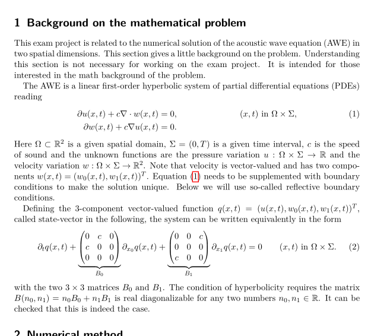

The exam project was on acoustic wave equation described below.  
  

In the exam project I had to:  
- compare performance of edge-based form and cell-based form of [wave_vanilla.cc](https://parcomp-git.iwr.uni-heidelberg.de/Teaching/hasc-code/-/blob/master/wave/wave_vanilla.cc)
- do roofline analysis
- implement parallelization with OpenMP
- implement SIMD vectorization using std :: simd
- implement parallelization with C++ threads (my selection from set of options)  

All work had to be done without help from other person or AI.  
We had separate oral question sessions with professor and tutor to make sure that no AI was used.

I intended to implement this with GPUs, and did that with the help of gemini.google.com  
(which is no problem because it was not part of the exam).

Details on the GPU implementation [here](GPU.md).

