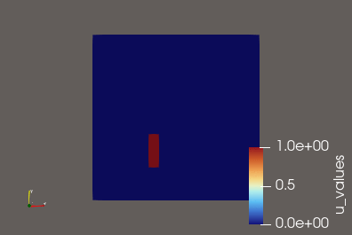
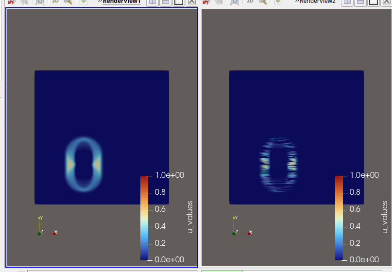

# First what did get achieved with the GPU impementations?  

In the exam project I achieved maximal speed up of $12.9\times$ for AMD 9950X 16C/32T CPU:  
```
hermann@9950X:~/hasc-code/wave$ OMP_NUM_THREADS=16 ./wave_omp 1026 32000 -100
using 16 threads
...
updates=1.05268e+08 elapsed=0.008942 performance=11.7038 giga updates per second
hermann@9950X:~/hasc-code/wave$
```

On my best (6.705 TFLOPS FP64) AMD Instinct MI50 server GPU 
```
hermann@7600x:~/uni-heidelberg/scripts$ ./wave_cell 1026 32000 -100
...
updates=1.05268e+08 elapsed=0.010109 performance=10.4179 giga updates per second
hermann@7600x:~/uni-heidelberg/scripts$ 
```

That is slower than AMD 9050X CPU, but for 1026 and more the CPU perfromance drops belowe 1 giga updates per second because the data does not fit into L3 cache anymore. No problem for AMD Instinct MI50 GPU, not for 1026x1026 and not even for 16386x16386 problem sizes!
```
hermann@7600x:~/uni-heidelberg/scripts$ ./wave_cell 2050 32000 -100
...
updates=4.2025e+08 elapsed=0.04522 performance=9.28613 giga updates per second
hermann@7600x:~/uni-heidelberg/scripts$ 
```
```
hermann@7600x:~/uni-heidelberg/scripts$ ./wave_cell 4098 32000 -100
...
updates=1.67936e+09 elapsed=0.219396 performance=7.64607 giga updates per second
^C
hermann@7600x:~/uni-heidelberg/scripts$ 
```
```
hermann@7600x:~/uni-heidelberg/scripts$ ./wave_cell 8194 32000 -100
...
updates=6.71416e+09 elapsed=0.968737 performance=6.93311 giga updates per second
^C
hermann@7600x:~/uni-heidelberg/scripts$ 
```
```
hermann@7600x:~/uni-heidelberg/scripts$ ./wave_cell 16386 32000 -100
...
updates=2.68501e+10 elapsed=4.81577 performance=5.58539 giga updates per second
^C
hermann@7600x:~/uni-heidelberg/scripts$
```

# Description of GPU implementation 

I did the GPU implementation with Gemini for these AMD GPUs ...  
- Instinct MI50, Radeon Pro VII, Radeon VII (all gfx906)
- RX Vega64, RX Vega56 (all gfx900)

... and these NVIDIA GPUs ...  
-  Tesla P100 (sm_60), RTX5060 (sm_120), GTX1660 TI (sm_75), Tesla K80 (sm_37)

using HIP. Top comment of [wave_cell.cc](../scripts/wave_cell.cc) has the build instructions, here for AMD GPUs:  
```
  export f=wave_cell
  export CCFLAGSBASE="-O3 -std=c++17"

  # Instinct MI50, Radeon Pro VII, Radeon VII;  RX Vega64, RX Vega56
  hipcc $CCFLAGSBASE --offload-arch=gfx906 --offload-arch=gfx900 $f.cc -o $f
```

```
usage: wave <cells per direction> <number of time steps> <every>
```

For negative values for "every" no output files get written, and computation speed is maximal:  
```
hermann@Radeon-vii:~/uni-heidelberg/scripts$ ./wave_cell 514 2000 -100
[HIP] Early Init: Legacy CPU detected (GenuineIntel). Set HSA_ENABLE_SDMA=0.
updates=2.64196e+07 elapsed=0.00799 performance=3.30658 giga updates per second
updates=2.64196e+07 elapsed=0.002692 performance=6.56035 giga updates per second
updates=2.64196e+07 elapsed=0.002661 performance=7.68305 giga updates per second
updates=2.64196e+07 elapsed=0.002516 performance=8.38745 giga updates per second
updates=2.64196e+07 elapsed=0.002502 performance=8.82184 giga updates per second
updates=2.64196e+07 elapsed=0.002507 performance=9.10792 giga updates per second
updates=2.64196e+07 elapsed=0.002504 performance=9.31407 giga updates per second
updates=2.64196e+07 elapsed=0.00251 performance=9.46553 giga updates per second
updates=2.64196e+07 elapsed=0.002509 performance=9.58379 giga updates per second
updates=2.64196e+07 elapsed=0.002511 performance=9.67757 giga updates per second
updates=2.64196e+07 elapsed=0.002504 performance=9.75697 giga updates per second
updates=2.64196e+07 elapsed=0.002508 performance=9.82173 giga updates per second
updates=2.64196e+07 elapsed=0.002502 performance=9.87847 giga updates per second
updates=2.64196e+07 elapsed=0.002504 performance=9.92651 giga updates per second
updates=2.64196e+07 elapsed=0.00251 performance=9.96646 giga updates per second
updates=2.64196e+07 elapsed=0.002508 performance=10.0019 giga updates per second
updates=2.64196e+07 elapsed=0.002505 performance=10.034 giga updates per second
updates=2.64196e+07 elapsed=0.002512 performance=10.0608 giga updates per second
updates=2.64196e+07 elapsed=0.002508 performance=10.0857 giga updates per second
updates=2.64196e+07 elapsed=0.002503 performance=10.1092 giga updates per second
hermann@Radeon-vii:~/uni-heidelberg/scripts$ 
```

For positive values of "every" output files for inspection with [ParaView](https://www.paraview.org/) get written as well:  
```
./wave_cell 514 2000 100
```
```
hermann@Radeon-vii:~/uni-heidelberg/scripts$ ls output_0000*
output_000000.vtk  output_000006.vtk  output_000012.vtk  output_000018.vtk
output_000001.vtk  output_000007.vtk  output_000013.vtk  output_000019.vtk
output_000002.vtk  output_000008.vtk  output_000014.vtk  output_000020.vtk
output_000003.vtk  output_000009.vtk  output_000015.vtk
output_000004.vtk  output_000010.vtk  output_000016.vtk
output_000005.vtk  output_000011.vtk  output_000017.vtk
hermann@Radeon-vii:~/uni-heidelberg/scripts$ 
```


Small demonstration of load data, display and play animation with ParaView here:  
[../res/paraview.recording.mp4](../res/paraview.recording.mp4)  

After problems fixed for legacy CPUs, ParaView animation of generated output*.vtk data:  



What impressed me most in my work with Gemini was the problem analysis for a problem happening on only two GPUs connected to old Intel i3-6100 CPUs. Only a short prompt and screenshot copied in!

## One of my prompts in a long chat with gemini.google.com:

OK, now the last code compiles and runs for Radeon vii, Radeon Pro VII, Instinct MI50, Tesla P100 and NVIDIA RTX5060. I compared the output files written with sequential known to be good output files with paraview. Only On Radeon vii and Radeon Pro vii I see the broken image after the initial image right, things become much worse for following images. The left shows the correct image for 100 when running "./wave_cell 514 2000 100".  The three working GPUs run on AMD 7600X, AMD 7950X and Intel W-2225 modern CPUs. The Radeon vii and Radeon Pro VII each run with an old Intel i3-6100 CPU. Since the code is identical, can it be that the i3-6100 CPU is responsible for the bad first output file? (I copied this screenshot into that promt as well):


## Answer from Gemini (Wow!):

**No, the Core i3-6100 CPU is not causing the image corruption.**

The CPU merely triggers kernel launches and handles file I/O. The corruption pattern shown in ParaView—where horizontal lines bleed or synchronization breaks as timesteps progress—indicates a **GPU memory visibility / cache coherency issue** or a **race condition inside your CUDA/HIP kernel**.

The reason this only occurs on the Radeon VII and Radeon Pro VII (and not on the MI50, P100, or RTX 5060) stems from hardware architecture differences and ROCm cache management:

---

### Key Causes of the Failure

* **GCN 5th Gen (gfx906) Cache Coherency:**
The Radeon VII and Radeon Pro VII use the `gfx906` architecture (Vega 20). Unlike modern RDNA or NVIDIA architectures, `gfx906` relies on aggressive write-back L2 caches. If your code uses persistent cooperative kernels (`cg::grid_group::sync()`) or relies on device memory updates across loop iterations, memory written by one Compute Unit (CU) might remain dirty in its local cache and not be visible to other CUs without explicit memory fences.
* **PCIe Gen3 Memory Snoop Latency (i3-6100 platform):**
The i3-6100 setup limits your setup to **PCIe Gen 3.0 x8/x16** without PCIe Peer-to-Peer atomics or SmartAccess Memory (SAM / ReBAR) supported by modern CPUs (like your 7950X or 7600X). If the kernel relies on host-allocated zero-copy memory or atomics over PCIe, system memory transfers will silently desynchronize on older PCIe platforms.
* **Missing Memory Fences in Cooperative Groups:**
If `wave_cell` uses a persistent kernel design where all timesteps run in a single launch synchronized via `grid.sync()`, `gfx906` requires explicit threadfence instructions to flush L1/L2 caches.

---

### How to Fix the Code

#### Fix 1: Add Explicit Memory Fences

If you are using cooperative groups for grid synchronization (`cg::this_grid().sync()`), ensure you issue a memory fence right before syncing. ROCm’s grid barrier does not automatically invalidate L1 caches on Vega 20:

```cpp
// Replace standalone grid.sync() with:
__threadfence();          // Flushes writes to global memory
grid.sync();              // Synchronize grid
__threadfence();          // Ensures updated global data is pulled from L2

```

#### Fix 2: Disable SDMA Engine via Environment Variable

On older PCIe platforms paired with `gfx906`, the System DMA (SDMA) engine can cause silent buffer corruptions during host-to-device transfers. Run your binary with SDMA disabled:

```bash
HSA_ENABLE_SDMA=0 ./wave_cell 514 2000 100

```

#### Fix 3: Disable Cache Coherency Optimizations (If using Host Memory)

If you allocated memory using `hipHostMalloc` or `cudaMallocHost`, ensure you set the coherent allocation flag explicitly on ROCm, or switch to standard device memory (`hipMalloc`) combined with `hipMemcpy`:

```cpp
// Change pinned/coherent memory allocation:
hipHostMalloc(&ptr, size, hipHostMallocNonCoherent);

// Or switch to explicit device memory transfers:
hipMalloc(&d_ptr, size);
// ... run kernel ...
hipMemcpy(h_ptr, d_ptr, size, hipMemcpyDeviceToHost);

```


## what finally worked

Conditionally disabling SDMA only for legacy CPUs per my request (code from Gemini):

```cpp
#if defined(__x86_64__) || defined(_M_X64)
  #include <immintrin.h>
  #include <cpuid.h>

// Executed automatically BEFORE main() and BEFORE ROCm driver initialization
__attribute__((constructor)) static void apply_sdma_workaround_early() {
    unsigned int eax, ebx, ecx, edx;
    char vendor[13];

    __cpuid(0, eax, ebx, ecx, edx);
    *reinterpret_cast<int*>(vendor) = ebx;
    *reinterpret_cast<int*>(vendor + 4) = edx;
    *reinterpret_cast<int*>(vendor + 8) = ecx;
    vendor[12] = '\0';

    bool is_legacy = false;

    if (__get_cpuid(1, &eax, &ebx, &ecx, &edx)) {
        int family = ((eax >> 8) & 0xF) + ((eax >> 20) & 0xFF);
        int model = ((eax >> 4) & 0xF) | ((eax >> 12) & 0xF0);

        std::string vendor_str(vendor);

        // Intel Pre-Ice Lake (Family 6, Skylake/Kaby Lake/Coffee Lake <= 0x9E)
        if (vendor_str == "GenuineIntel" && family == 6 && model <= 0x9E) {
            is_legacy = true;
        }
        // AMD Pre-Zen 3 (Family < 0x19)
        else if (vendor_str == "AuthenticAMD" && family < 0x19) {
            is_legacy = true;
        }
    }

    if (is_legacy) {
        setenv("HSA_ENABLE_SDMA", "0", 1);
        std::fprintf(stderr, "[HIP] Early Init: Legacy CPU detected (%s). Set HSA_ENABLE_SDMA=0.\n", vendor);
    }
}
#endif
```
