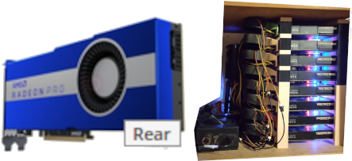

[Radeon Pro VII Specs](https://www.techpowerup.com/gpu-specs/radeon-pro-vii.c3575)   
  

[main.cpp](../scripts/main.cpp)

```
$ cat build 
#!/bin/bash
g++ -O3 main.cpp -o gemm_bench -I/opt/rocm/include -L/opt/rocm/lib -lOpenCL
$
```

```
$ cat run 
#!/bin/bash
LD_LIBRARY_PATH=/opt/rocm/lib:$LD_LIBRARY_PATH ./gemm_bench
$
```

Execution:
```
$ ./gemm_bench 
MI50 Steady-State Peak: 5.44 TFLOPS
Execution time: 25.42 seconds
$
```

## How this compares to your AVX-512 CPU

Your CPU was hitting ~1.2 TFLOPS. Your GPU is now hitting ~5.4 TFLOPS.
- The GPU is ~4.5x faster at pure raw math than your high-end 16-core CPU.
- Efficiency: Your CPU is likely pulling 151W-200W for that 1.2 TFLOPS. Your GPU is pulling 82W for 5.4 TFLOPS.

