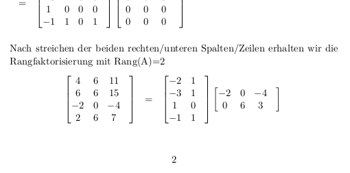

## Rangfaktorisierung

Nach Lösen der Rangfaktorisierungsaufgaben 10.3c mit Papier und Kueglschreiber hatte ich keine Lust die ganzen Matrizenrechnungen in LaTex einzugeben (wir bearbeiten Übungszettel in LaTex). Stattdesseen habe ich lieber in einer Stunde ein 75 zeiliges Skript geschrieben, welches 246 Zeilen LaTex erzeugt, welches nach übersetzen in 2 vollen A4 Seiten PDF für die Abgabe resultiert ([preview](../res/10.3c.i.pdf) des 2-seitigen PDF files).


Man  kann so ein Skript in jeder Sprache schreiben, z.B. in der IPI Vorlesungssprache Python.   
Ich habe [PARI/GP](https://pari.math.u-bordeaux.fr/) gewählt, da Matrixmultiplikation (und Rechnen in $\mathbb{Z}\setminus {2\mathbb{Z}}$ für die 2. Aufgabe [10.3c.ii.gp](../scripts/10.3c.ii.gp)) so einfach sind.

Einfach Skript [10.3c.i.gp](../scripts/10.3c.i.gp) ausführen, mit LaTex übersetzen und das war es schon:
```
$ gp -q < 10.3c.i.gp > 10.3c.i.tex
$ latexmk 10.3c.i.tex 2>/dev/null >/dev/null
$ ls *.pdf
10.3c.i.pdf
$ 
```

So sieht das untere Ende der 2. Seite aus, Screenshot und entsprechendes generiertes LaTex:   
   
```
...
\end{bmatrix}\\
\end{eqnarray*}Nach streichen der beiden rechten/unteren Spalten/Zeilen
erhalten wir die Rangfaktorisierung mit Rang(A)=2\begin{eqnarray*}
\begin{bmatrix}4&6&11&\\
6&6&15&\\
-2&0&-4&\\
2&6&7&\\
\end{bmatrix}
&=&
\begin{bmatrix}-2&1&\\
-3&1&\\
1&0&\\
-1&1&\\
\end{bmatrix}\begin{bmatrix}-2&0&-4&\\
0&6&3&\\
\end{bmatrix}\\
\end{eqnarray*}
\end{document}
```

Skript macht die Rangfaktorisierung nicht automatisch, ist aber "good enough".   
Diese paar Zeilen erzeugen den kompletten LaTex output:
```
...
header();
pmat(A); simple_row();
row("T(3,1)","T_{3,1}"); simple_row();
row("S(2,1,3)","S_{2,1}(3)"); simple_row();
row("S(3,1,2)","S_{3,1}(2)"); simple_row();
print("\\end{eqnarray*}\\newpage\\begin{eqnarray*}");
row("S(4,1,1)","S_{4,1}(1)"); simple_row();
row("S(4,2,-1)","S_{4,2}(-1)"); simple_row();
row("S(3,2,-1)","S_{3,2}(-1)"); simple_row();
print("\\end{eqnarray*}Nach streichen der beiden rechten/unteren Spalten/Zeilen");
print("erhalten wir die Rangfaktorisierung mit Rang(A)=2\\begin{eqnarray*}");
B=B[,1..2];
C=C[1..2,];
pmat(A);
simple_row();
footer();
```
