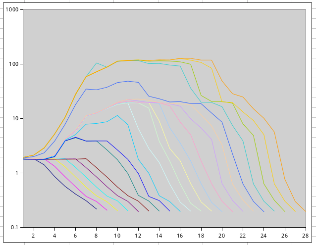
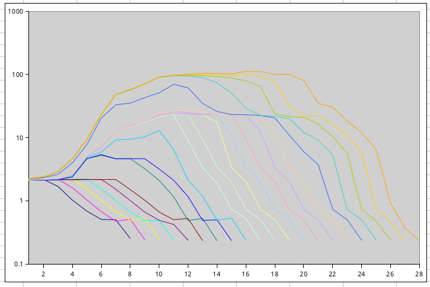
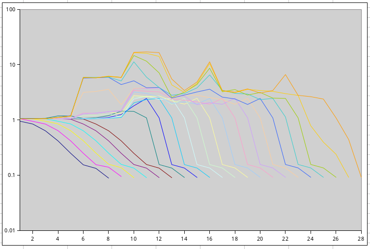
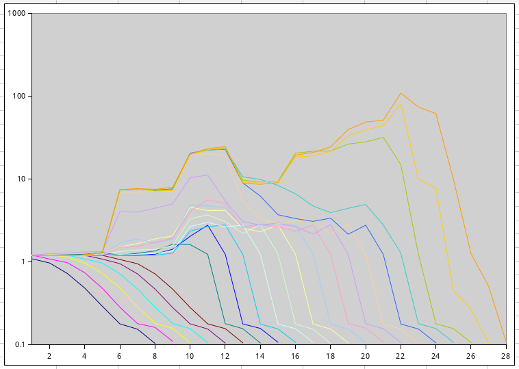
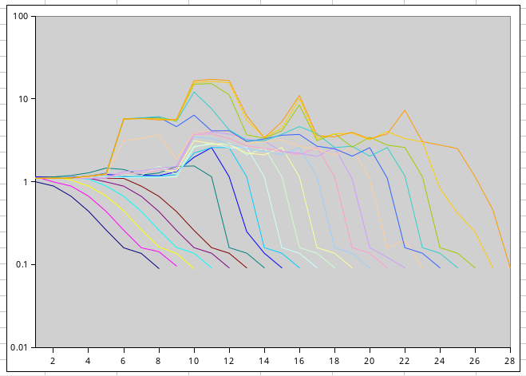
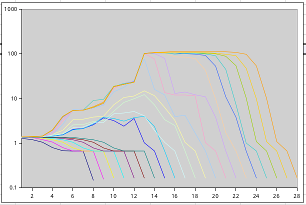

[pointer_chasing.cc](https://parcomp-git.iwr.uni-heidelberg.de/Teaching/hasc-code/-/blob/master/benchmarking/pointer_chasing.cc?ref_type=heads)

Measurements were done with strides as powers of 2 between 1 and 256\*1024\*1024 in array of size 512\*1024\*1024 (horizontal axis).

Vertical axis shows the number of clock cycles per instruction.

Results are sorted reverse by number of cores of a single CPU.

----

8× 24C/48T Intel Xeon E7 8890v4 CPUs in Lenovo x3950-X6 8-socket server:  
```
hermann@x3950-X6:~$ lscpu | grep -i "cache"
L1d cache:                               6 MiB (192 instances)
L1i cache:                               6 MiB (192 instances)
L2 cache:                                48 MiB (192 instances)
L3 cache:                                480 MiB (8 instances)
hermann@x3950-X6:~$ 
```


----
2× 22C/44T Intel Xeon E5 2696v4 CPUs in Dell PowerEdge R630 2-socket server:
```
hermann@E5-2696v4:~$ lscpu | grep -i "cache:"
L1d cache:                               1.4 MiB (44 instances)
L1i cache:                               1.4 MiB (44 instances)
L2 cache:                                11 MiB (44 instances)
L3 cache:                                110 MiB (2 instances)
hermann@E5-2696v4:~$ 
```



----
16C/32T AMD Ryzen 7 7950X CPU in PC:  
```
hermann@7950x:~$ lscpu | grep -i "cache"
L1d cache:                               512 KiB (16 instances)
L1i cache:                               512 KiB (16 instances)
L2 cache:                                16 MiB (16 instances)
L3 cache:                                64 MiB (2 instances)
hermann@7950x:~$ 
```
  

----
8C/16T AMD Ryzen 7 8840HS CPU in laptop:  
```
pi@raspberrypi5:~/uni-heidelberg $ lscpu | grep -i "cache"
L1d cache:                               256 KiB (4 instances)
L1i cache:                               256 KiB (4 instances)
L2 cache:                                2 MiB (4 instances)
L3 cache:                                2 MiB (1 instance)
pi@raspberrypi5:~/uni-heidelberg $ 
```
  

----
6C/12T AMD Ryzen 7 7600X CPU in PC:  
```
hermann@7600x:~$ lscpu | grep -i "cache"
L1d cache:                               192 KiB (6 instances)
L1i cache:                               192 KiB (6 instances)
L2 cache:                                6 MiB (6 instances)
L3 cache:                                32 MiB (1 instance)
hermann@7600x:~$ 
```
  


----
4C/4T ARM Cortex A76 CPU in Raspberry Pi5 single board computer:  
(overclocked with 3GHz; default clock is 2.4GHz)
```
pi@raspberrypi5:~ $ lscpu | grep -i "cache"
L1d cache:                               256 KiB (4 instances)
L1i cache:                               256 KiB (4 instances)
L2 cache:                                2 MiB (4 instances)
L3 cache:                                2 MiB (1 instance)
pi@raspberrypi5:~ $ 
```
  

